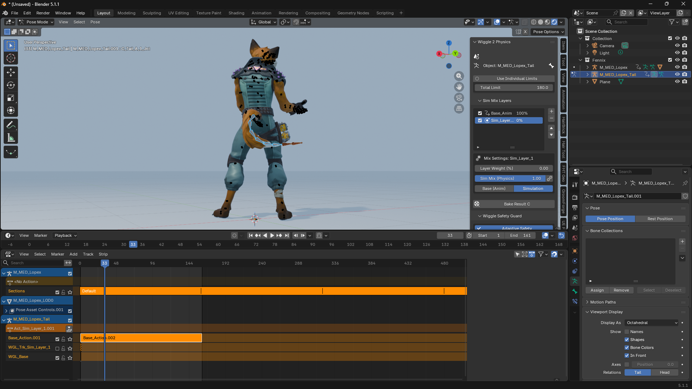
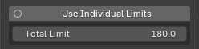
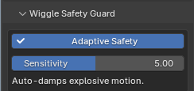
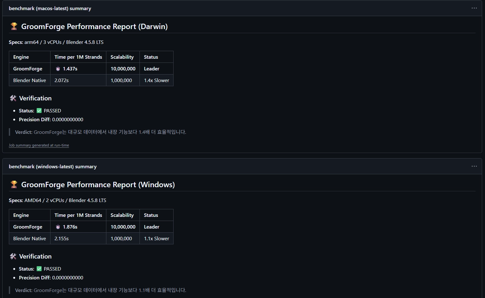
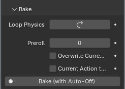

# Welcome to the Wiggle 2: RTX Edition Wiki

*  "The Most Versatile Physics Solution for Rigs of All Kinds.
*  "While optimized for high-density hair, Wiggle 2: RTX Edition is a universal physics engine designed for any bone-based setup. 
*  From complex character tails and dynamic clothing to subtle accessory vibrations, it brings lifelike, procedural movement to every part of your rig.

<video width="100%" controls>
  <source src="assets/blender_ppr2ap3Es5.mp4" type="video/mp4">
  Your browser does not support the video tag.
</video>

*  Wiggle 2: RTX Edition is a professional physics solution engineered to bring dynamic, 
*  lifelike movement to massive hair setups. Optimized for high-end character production, 
*  it serves as a critical pillar in the modern grooming pipeline, especially when paired with GroomForge PRO.

---

## ✨ Why RTX Edition?
Experience next-level features that go far beyond the standard Wiggle 2. The RTX Edition is built for professional stability and complex multi-layered setups.

*   **Universal Bone Physics**: Not just for hair. Optimized for **Tails, Clothing, Capes, and any bone-based rig** requiring organic secondary motion.
*   **Modern API Support**: Fully compatible with Blender 4.2 LTS, 5.0, and 5.1+ environments.
*   **Layered Physics System**: A revolutionary system allowing independent physics control for different rig sections (layers) within a single armature.
*   **Advanced Keyframe & Sim Baking**: High-fidelity conversion of simulation data into animation keyframes, ensuring 100% match between Blender and Game Engines.
*   **High-Density Optimization**: Delivers smooth, lag-free viewport performance even with complex rigs involving tens of thousands of bones.

---

## 🚀 Key Synergy: The Master's Workflow
The ultimate character production pipeline is achieved through the seamless integration of these two powerful tools:

*   [**GroomForge PRO**](https://github.io): The industry's most advanced tool for precision creation, UV packing, and Groom Exporting for Unreal Engine 5.
*   **Wiggle 2 RTX**: Adds the final layer of life. It applies high-speed layered physics to GroomForge-generated rigs and provides seamless baking, optimized specifically for **UE5 MetaHuman** pipelines.

Together, they form a "Zero-Waste" ecosystem—from initial strand creation to the final physics-baked export.

---

## 📖 User Guide: Wiggle 2 Physics v2.1.9

### Step 1: Initializing your Physics Stack
To begin using Wiggle 2 RTX, you must first define your animation and simulation layers. The system will not calculate physics until these layers are initialized.

<video width="100%" controls>
  <source src="assets/blender_mV2e3Pqf7z.mp4" type="video/mp4">
</video>
---

#### Critical Prerequisite: Push Down Action
!!! tip
       Before adding layers, your base animation must be pushed down into the NLA (Non-Linear Animation) stack.
       Requirement: The system identifies the "Base_Anim" layer by looking at the pushed-down action strips in the NLA Editor.
       How-to: Select your armature > Go to the NLA Editor > Click the 'Push Down' button on your active action.

#### Layer Setup
*   Add Base Layer: Click the + button to add your Base_Anim layer.
*   Add Sim Layer: Add one or more Sim_Layers where the RTX physics engine lives.

<video width="100%" controls>
  <source src="assets/blender_yPncVZCJMz.mp4" type="video/mp4">
</video>

---

## 🛠️ Step 2: Stability and Safety Guards

### 1) Use Individual Limits

*   Toggle: Switches between per-bone individual limits and global settings.
*   Total Limit: Sets the maximum allowed rotation. Higher values allow larger motion; lower values (e.g., 30-60°) prevent mesh clipping.

<video width="100%" controls>
  <source src="assets/blender_oJBmdVyU4K.mp4" type="video/mp4">
</video>

---

## 🚀 Step 3: Sim Mix Layers Unified Workflow
This core feature handles keyframes (animation) and simulation (physics) as a single unified data flow.

*   **Bake Result C (Composite Bake)**: Merges keyframes and simulation into a single keyframe track while preserving the exact layer mix weights.
*   **Non-destructive workflow**: Keeps `Base_Anim` untouched while cleanly extracting only the simulated result.
*   **Game-engine friendly**: Flattens the animation so Unity/Unreal playback matches the Blender viewport 100%.

<video width="100%" controls>
  <source src="assets/blender_K4ijchgKlX.mp4" type="video/mp4">
</video>

---

## 🛡️ Step 4: Wiggle Safety Guard (Adaptive Safety)

A "safety net" that prevents uncontrolled behavior such as explosions or infinite jitter during simulation.
1. **Adaptive Safety**: Detects abnormal velocity / excessive energy buildup and applies real-time damping to stabilize.
2. **Sensitivity (e.g., 5.00)**: Higher values react more aggressively to small vibrations.
3. **Note**: This feature is currently closer to an experimental stage. If motion becomes too stiff, turn it off or lower Sensitivity.

---

## ⚙️ Step 5: Tail Settings (RTX Optimization Core)

The most frequently used core settings area, with many stability improvements in v2.1.9.
1. **Physics parameters**: Improved Mass/Gravity issues and more accurate Stretch recovery behavior.
2. **Wind**: More precise, coherent responses across multiple bones.
3. **Collisions (notable improvements)**: Stronger sub-stepping to reduce pass-through and pinching. Smoother stabilization for jittering related to Radius / Friction / Sticky.
4. **Chain**: Added energy decay logic to reduce “tip energy buildup” explosions.

---

## ⚡ Step 6: Global Utilities

### Quick Presets (One-click Presets)
Applies optimized baseline values for common scenarios: **Jelly / Hair / Heavy / Cloth / Spring / Antenna**.
*   **Tip**: Apply a preset first, then fine-tune in Tail Settings.

<video width="100%" controls>
  <source src="assets/blender_8HdT3mHN1b.mp4" type="video/mp4">
</video>

### Collision Guide Options
*   **Collision Shape**: Box / Cylinder / Capsule (recommended).
*   **Visual Guide**: View collision volume as a viewport wireframe guide.
*   **Interaction**: Adjust Radius / Friction / Bounce / Sticky.
*   **Collisions**: Set targets by Object or Collection.

<video width="100%" controls>
  <source src="assets/blender_zAh4yUSDHu.mp4" type="video/mp4">
</video>

---

## 🔄 Step 7: Loop Physics and Final Bake

*   **Loop Physics**: Smoothly connects physics state from last frame back to the first.
*   **Preroll**: Stabilization frames before baking (typically 10~30 frames).
*   **Bake (with Auto-Off)**: Automatically turns off realtime physics after the bake completes.
*   **Overwrite Current / Current Action to...**: Choose how the baked result is stored.

---

**💡 Final Optimization Tip (The "Zero Waste" Rule)**
Use a **256px** guide image in **GroomForge PRO** for optimized UV layouts to ensure **Wiggle 2 RTX** physics run faster and more stable.
