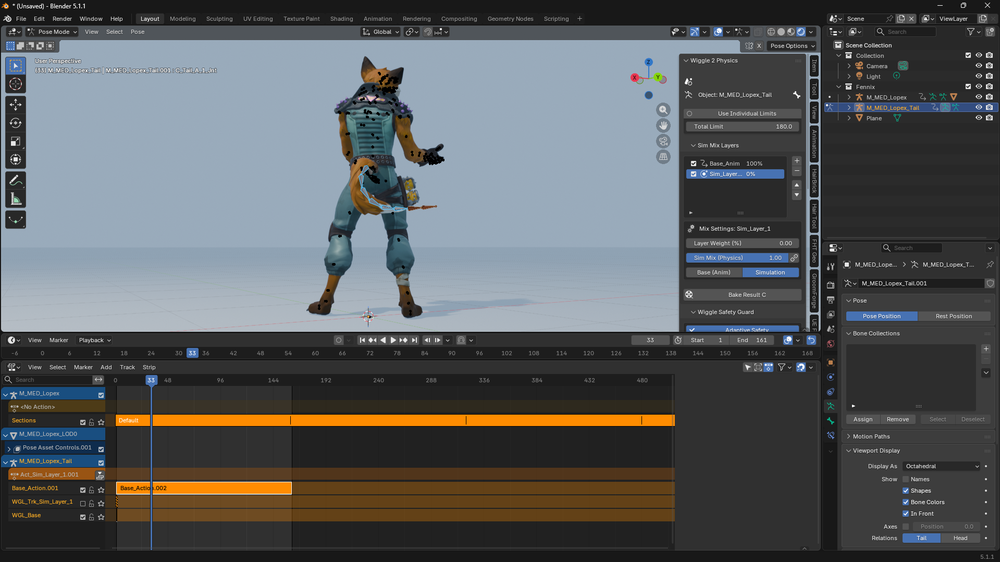
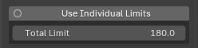
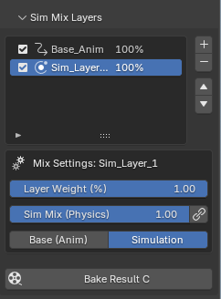
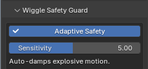
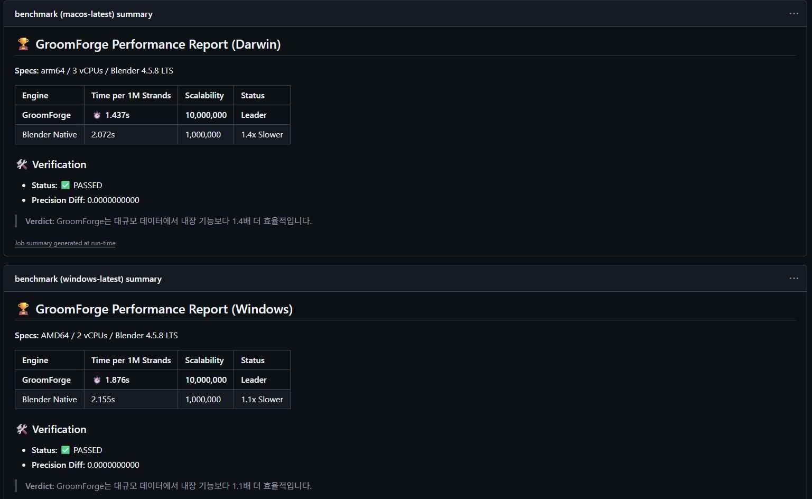
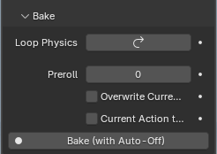

# Welcome to the Wiggle 2: RTX Edition Wiki

*  "The Most Versatile Physics Solution for Rigs of All Kinds.
*  "While optimized for high-density hair, Wiggle 2: RTX Edition is a universal physics engine designed for any bone-based setup. 
*  From complex character tails and dynamic clothing to subtle accessory vibrations, it brings lifelike, procedural movement to every part of your rig.

<video width="100%" controls>
  <source src="assets/blender_ppr2ap3Es5.mp4" type="video/mp4">
  Your browser does not support the video tag.
</video>

*  Wiggle 2: RTX Edition is a professional physics solution engineered to bring dynamic, 
*  lifelike movement to massive hair setups. Optimized for high-end character production, 
*  it serves as a critical pillar in the modern grooming pipeline, especially when paired with GroomForge PRO.

---

## 🆕 What's New in v2.4.0

This update merges the September development branch into the main addon (Auto Cache, Auto Clean Reset, Field Collections, Smart Bake, modal bakes with progress/Esc cancel, auto-key protection, Copy performance, and NLA influence keyframe hygiene), and fixes two issues found during full runtime verification:

*   **Fixed (critical): playback could crash Blender 4.x / 5.0.x.** The auto clean reset re-evaluated the dependency graph from inside the frame-change handler, which could segfault Blender during playback start or rewinds on older versions. The rest pose is now derived directly, without re-entering the depsgraph.
*   **Fixed: Adaptive Safety Guard did not react to fast motion.** Its per-object trackers are now stored as module-level state (the previous scene-property storage silently reset every frame), so movement/rotation detection works again.
*   **Disk cache now stores the complete bone state** (collision/sticky info and the adaptive damping modifier), so cached frames restore everything the live simulation had. Older cache files are still accepted.
*   **Bake to Disk Cache leaves "Use Cache During Playback" enabled** after a successful bake, so scrubbing uses the cache immediately.

**Reference — Gunvaldis Urtāns:** The September update this release builds on was provided by Gunvaldis Urtāns (September 23 messages): the revised build with the **Auto Reset on Rewind** option, plus the fix so **Layer Weight no longer keyframes itself while Auto Key is on**. Both are fully incorporated in this release. Thank you!

---

## ✨ Why RTX Edition?
Experience next-level features that go far beyond the standard Wiggle 2. The RTX Edition is built for professional stability and complex multi-layered setups.

*   **Universal Bone Physics**: Not just for hair. Optimized for **Tails, Clothing, Capes, and any bone-based rig** requiring organic secondary motion.
*   **Modern API Support**: Fully compatible with Blender 4.2 LTS, 5.0, and 5.1+ environments.
*   **Layered Physics System**: A revolutionary system allowing independent physics control for different rig sections (layers) within a single armature.
*   **Advanced Keyframe & Sim Baking**: High-fidelity conversion of simulation data into animation keyframes, ensuring 100% match between Blender and Game Engines.
*   **High-Density Optimization**: Delivers smooth, lag-free viewport performance even with complex rigs involving tens of thousands of bones.

---

## 🚀 Key Synergy: The Master's Workflow
The ultimate character production pipeline is achieved through the seamless integration of these two powerful tools:

*   [**GroomForge PRO**](https://github.io): The industry's most advanced tool for precision creation, UV packing, and Groom Exporting for Unreal Engine 5.
*   **Wiggle 2 RTX**: Adds the final layer of life. It applies high-speed layered physics to GroomForge-generated rigs and provides seamless baking, optimized specifically for **UE5 MetaHuman** pipelines.

Together, they form a "Zero-Waste" ecosystem—from initial strand creation to the final physics-baked export.

---

## 📖 User Guide: Wiggle 2 Physics v2.4.0

### Step 1: Initializing your Physics Stack
To begin using Wiggle 2 RTX, you must first define your animation and simulation layers. The system will not calculate physics until these layers are initialized.

<video width="100%" controls>
  <source src="assets/blender_mV2e3Pqf7z.mp4" type="video/mp4">
</video>
---

#### Critical Prerequisite: Push Down Action
!!! tip
       Before adding layers, your base animation must be pushed down into the NLA (Non-Linear Animation) stack.
       Requirement: The system identifies the "Base_Anim" layer by looking at the pushed-down action strips in the NLA Editor.
       How-to: Select your armature > Go to the NLA Editor > Click the 'Push Down' button on your active action.

#### Layer Setup
*   Add Base Layer: Click the + button to add your Base_Anim layer.
*   Add Sim Layer: Add one or more Sim_Layers where the RTX physics engine lives.

<video width="100%" controls>
  <source src="assets/blender_yPncVZCJMz.mp4" type="video/mp4">
</video>

---

## 🛠️ Step 2: Stability and Safety Guards

### 1) Use Individual Limits

*   Toggle: Switches between per-bone individual limits and global settings.
*   Total Limit: Sets the maximum allowed rotation. Higher values allow larger motion; lower values (e.g., 30-60°) prevent mesh clipping.
*   **v2.2.6 fix**: Total Limit now holds correctly at every **Quality** level. Previously, raising Quality could let the bone swing far past the number you set (e.g. 10° behaving like 90°) — that's fixed, so you can safely raise Quality for smoother motion without your limit breaking.
*   **v2.2.9 fix (Blender 5.2)**: Total Limit could show a broken, unreadable field instead of a number right after enabling the addon. That's fixed — if you still ever see this, use Blender's "Reload Scripts" once.
*   **Individual Limits (X / Z)**: Instead of one cone-shaped Total Limit, this lets you set separate up-down (X) and left-right (Z) ranges — useful for things like eyelids or fins that should only move in one plane.

<video width="100%" controls>
  <source src="assets/blender_oJBmdVyU4K.mp4" type="video/mp4">
</video>

---

## 🚀 Step 3: Sim Mix Layers Unified Workflow
This core feature handles keyframes (animation) and simulation (physics) as a single unified data flow.

*   **Layer Weight (%)**: Cross-fades this layer against everything below it (0% = fully hidden, 100% = fully replaces what's below). **v2.2.9 fix**: dragging this to 0% used to make the Influence value shown in the NLA editor visibly freeze instead of reaching 0 — it now updates correctly at every step down to 0%. **v2.2.9 fix**: if a strip is left open for editing in NLA Tweak Mode (e.g. from double-clicking it in the NLA editor), this panel now shows a clear warning with a one-click button to exit Tweak Mode and restore Layer Weight — previously it would just silently stop doing anything with no explanation.
*   **Bake Result C (Composite Bake)**: Merges keyframes and simulation into a single keyframe track while preserving the exact layer mix weights. **As of v2.2.8, the Bake Result C button and all its settings (Preroll/Overwrite/NLA) live under Global Utilities → Bake, below Loop Physics** — not in this panel. This is still the **only** bake control in the addon; see Step 7 below for the full bake workflow.
*   **v2.2.8 fix**: Bake Result C now captures **every bone in the armature**, not just wiggle-enabled ones. Previously a "combined" bake silently skipped anything Base alone was driving (torso, limbs, etc.), so the result wasn't actually self-contained — it only looked that way until you removed Base.
*   **Non-default behavior**: By default, baking creates a **new Sim layer** (named "Bake", "Bake 2", ...) with its own new action, added to the Sim Mix Layers list and auto-selected — non-destructive to your existing layers, so you can bake the same range multiple times to compare variations without losing earlier results. Turning on **Overwrite Current Action** (Step 7) changes this: with a Sim layer selected in this list, baking writes directly into that layer's own action instead of creating a new one.
*   **Fixed (v2.2.7)**: the baked result now always reads the true combined Base+Sim pose at every frame before writing any keyframes, so it always matches exactly what you see in the viewport before baking.
*   **Non-destructive workflow**: Keeps `Base_Anim` (and every existing Sim layer) untouched while cleanly extracting only the simulated result into its own layer (unless Overwrite is on — see above).
*   **Game-engine friendly**: Flattens the animation so Unity/Unreal playback matches the Blender viewport 100%.

<video width="100%" controls>
  <source src="assets/blender_K4ijchgKlX.mp4" type="video/mp4">
</video>

---

## 🛡️ Step 4: Wiggle Safety Guard (Adaptive Safety, Self Collision & Lattice)

This panel is a "safety net" that prevents uncontrolled behavior such as explosions or infinite jitter during simulation. It now bundles three separate tools:

### 1) Adaptive Safety
1. **Adaptive Safety**: Detects abnormal velocity / excessive energy buildup and applies real-time damping to stabilize.
2. **Sensitivity (e.g., 5.00)**: Higher values react more aggressively to small vibrations.
3. **Rotation Threshold (deg/s)**: New in this update. Works alongside Sensitivity, but watches for *spinning* speed instead of position. If a bone starts spinning faster than this value (degrees per second), the guard damps it down before it explodes. Lower the value if you still see fast "whipping" motion after enabling Adaptive Safety.
4. **Note**: This feature is currently closer to an experimental stage. If motion becomes too stiff, turn it off or lower Sensitivity.

### 2) Self Collision (New)
*   **Self Collision (this object)**: Turn this on per-armature to let a rig's own wiggle bones push each other apart instead of passing through themselves. Great for thick tails, bundled hair strands, or overlapping skirt panels. Off by default because it costs extra performance — only enable it where you actually see clipping.
*   **Margin**: Extra buffer distance added on top of each bone's own Radius setting (found in Tail Settings) before bones are pushed apart. Raise this slightly if bones still visibly touch.

### 3) Horizontal Lattice Stabilizer
*   **Horizontal Lattice Stabilizer**: Enable this to link same-depth bones across neighboring chains (for example, the 3rd bone of every strand in a skirt or hair bunch). This keeps a group of dangling chains moving together as a coherent shape instead of flailing independently.
*   **Lattice Stiffness**: How strongly linked bones pull back toward each other. Higher = tighter, more uniform grouping.
*   **Stretch Tolerance**: How much the lattice link can stretch before it starts correcting. Raise this if you see popping/snapping between linked bones; lower it for a tighter group.
*   **Show Lattice Guide**: Draws the connecting lines in the viewport so you can see which bones are linked.
*   **Active Bone is Lattice Collider**: Mark the currently selected bone as a solid obstacle that other lattice-linked bones should avoid, with an adjustable Radius.
*   **Tip**: This stabilizer runs in real time in the viewport (independent of the frame-by-frame simulation clock), so it reacts immediately as you scrub or drag — it's meant purely as a visual/interactive stabilizer for grouped strands, not as part of the baked physics result.

---

## ⚙️ Step 5: Tail & Head Settings (RTX Optimization Core)

The most frequently used core settings area, with many stability improvements in v2.2.6.

1. **Physics parameters**: Mass, Stiff, Stretch, Damp, and Gravity, same as before — improved recovery behavior so stretched bones snap back more predictably.
2. **Freeze this bone side (Mute)**: New Mute icon next to "Tail Settings" and "Head Settings" in the panel header. Toggling it pauses physics for just that side of the bone (it snaps back to follow the animated rest pose) without disabling the whole bone or object — handy for troubleshooting a single misbehaving bone without losing your other settings.
3. **Stiff / Damp Root-Tip Distribution**: Click the small curve icon next to Stiff or Damp to reveal **Root** and **Tip** sliders. This tapers the value along the whole chain below the selected bone (e.g. stiffer near the root, looser at the tip) instead of one flat value for every bone. Dragging Root/Tip now updates the whole chain live as you type.
4. **Wind**: Assign any Blender Force Field object to the Wind slot. As of v2.2.6 this also works correctly on **Head Settings** (previously head-side wind was silently ignored). Three field types are supported:
   *   **Wind**: A steady directional push.
   *   **Turbulence**: Chaotic, randomized motion — good for flags, leaves, loose hair.
   *   **Vortex**: Swirling motion around the field object — good for magical/energy effects or hair caught in a draft.
5. **Collisions**: Choose a collision source next to "Collisions":
   *   **Object**: Collide against a real mesh object.
   *   **Collection**: Collide against every mesh in a Collection at once.
   *   **Sphere / Box / Cylinder / Capsule** (New): Collide against a simple procedural shape instead of a mesh. Just pick any object (an Empty works great) and its own scale defines the size of the shape — no need to model actual collision geometry. Capsule is recommended for limbs, tails, and fingers.
6. **Radius / Friction / Bounce / Sticky**: Fine-tune how the bone reacts on contact. **Bounce** now actually reflects the bone off the surface (previously it had no effect) — 0 means it just stops on contact, higher values make it spring off.
7. **Chain**: Reduces "tip energy buildup" so the far end of long chains doesn't build up excess energy and explode outward.

---

## ⚡ Step 6: Global Utilities

### Quick Presets (One-click Presets)
Applies optimized baseline values for common scenarios: **Jelly / Hair / Heavy / Cloth / Spring / Antenna**.
*   **Tip**: Apply a preset first, then fine-tune in Tail Settings.

<video width="100%" controls>
  <source src="assets/blender_8HdT3mHN1b.mp4" type="video/mp4">
</video>

### Collision Guide Options
*   **Collision Shape**: Box / Cylinder / Capsule (recommended).
*   **Visual Guide**: View collision volume as a viewport wireframe guide.
*   **Interaction**: Adjust Radius / Friction / Bounce / Sticky.
*   **Collisions**: Set targets by Object or Collection.

<video width="100%" controls>
  <source src="assets/blender_zAh4yUSDHu.mp4" type="video/mp4">
</video>

---

## 🔄 Step 7: Loop Physics and Final Bake

> **Location (v2.2.8)**: this entire step now lives under **Global Utilities → Bake**, with Loop Physics at the top of that same panel and everything else below it — not in the Sim Mix Layers panel. There is still only one bake control in the whole addon: **Bake Result C**.

*   **Loop Physics**: Smoothly connects physics state from last frame back to the first, so a looping animation doesn't "snap" or reset at the seam. Turn it on before baking a looping cycle (walk cycles, idle animations, etc.).
*   **Preroll**: Number of extra stabilization frames simulated *before* your bake range starts (typically 10~30 frames), so the physics has already "settled" by the time your actual animation begins instead of starting from a stiff, frozen pose.
*   **Overwrite Current Action**: When off (default), each bake creates a **new Sim layer + action** in Sim Mix Layers, leaving everything else untouched. When on, baking writes directly into whichever **Sim layer is currently selected** in the Sim Mix Layers list, overwriting that layer's own action instead of creating a new one — select the layer you want to update first.
*   **Current Action to NLA**: When on, your existing action is pushed down to an NLA track before baking, keeping it safely archived instead of being overwritten.
*   **Bake Result C**: The button that actually runs the bake, using the three settings above. Always bakes the entire armature (every bone, not just wiggle-enabled ones) so the result is a complete, self-contained action — see Step 3 for details on what gets combined.

### Disk Point Cache (New)
For long or heavy simulations, scrubbing the timeline normally forces Wiggle 2 to re-simulate every frame from the start each time you jump backward — which gets slow on long ranges. The new **Disk Point Cache** box lets you:
*   **Bake to Disk Cache**: Simulates your full frame range once and saves every frame's physics result to disk.
*   **Use Cache During Playback**: While enabled, scrubbing/playback loads the saved result instantly instead of re-simulating.
*   **Clear Cache**: Deletes the saved cache — do this after changing any physics settings, since the cache does not auto-detect setting changes.
*   **Directory**: Where cache files are stored (defaults to a folder next to your `.blend` file).

---

**💡 Final Optimization Tip (The "Zero Waste" Rule)**
Use a **256px** guide image in **GroomForge PRO** for optimized UV layouts to ensure **Wiggle 2 RTX** physics run faster and more stable.
