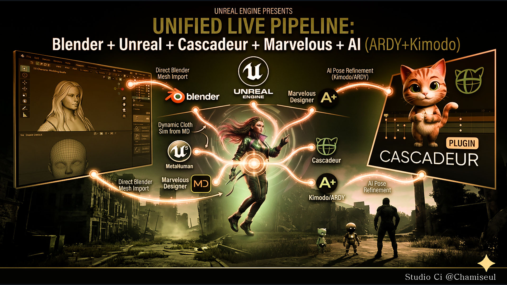

<!--
  HOW TO ADD AN ENTRY
  -------------------
  Newest first, straight under "In testing now". Copy this block:

      ## Short headline
      **Product** · optional second product

      One sentence saying what you will be able to do that you cannot today.

      * Plain statement of an outcome.
      * Another one.

      

  No dates. Nothing here is promised for a particular day - it ships when the
  testing says it is ready, and a date that slips costs more than it buys.

  Only finished work goes here. Anything still being built, or started and put
  down, stays off the page until it works - announcing it early turns a change
  of plan into a broken promise.

  Say what it DOES, not how it works. "Bringing animation back from Cascadeur
  now takes under a second" - not what was changed to make that true. Anyone
  reading this wants to know whether it helps them.

  Images and GIFs go in docs/assets/ and are linked as ../assets/name.ext .
  One per entry is plenty; a short GIF beats a paragraph.
-->

# News

Development updates from the Studio Ci pipeline — Blender, Unreal Engine,
Cascadeur and Marvelous Designer, tied together so a character can move
between them without falling apart on the way.

Everything below is built and running here. What has been released is under
**Out now**; the rest is going through testing, and follows when the testing
says it is ready — soon, and without a date attached to it. Products already
available are on the [Pipeline](../integration.md) page.

---

## Out now

**MetaBridge DNA 2.1.0** is released. Everything in this section is in it.

The ARDY Engine and the Cascadeur plug-in are on
[Patreon](https://www.patreon.com/cw/ChamIseul) — check there for how to get
them. MetaBridge DNA is on the [Pipeline](../integration.md) page.

## Cascadeur animation comes back into Blender
**MetaBridge DNA** · coming to **MotionForge** too

The Cascadeur bridge works both ways. Send a character across, animate it
there, and bring the animation back — on the same character, in the same
scene, with nothing to re-import.

* Two ways to bring work back: **the animation only**, keyed onto the rig you
  already have, or **the mesh and the animation together** as new objects.
* Reading a full MetaHuman take takes **under a second**.
* Root motion comes with it — the character travels instead of walking on the
  spot.
* Restarting Cascadeur costs you nothing. Blender remembers what it needs and
  hands it back.

<!--  -->

---

## Received animation lands on your Rigify controls
**MetaBridge DNA**

Animate in Cascadeur, then keep working in Blender the way you normally do.

* Tick **Onto Rigify Controls** and the animation arrives on the control rig,
  not the deform bones — so it can be adjusted, offset and layered like any
  animation you keyed by hand.
* The body rig goes back to being driven by the controls, so nothing fights
  for the same bone.

<!--  -->

---

## The face plays live in Unreal, with nothing exported
**MetaBridge DNA** · Unreal Engine

A MetaHuman face animated in Blender performs in Unreal as you work on it.

* Only the control values cross — about a kilobyte a frame — and Unreal's own
  Rig Logic produces the joints, the shapes and the wrinkle maps.
* Body and face stream together onto the same MetaHuman.

<!--  -->

---

## Garments come back from Marvelous Designer in two clicks
**MetaBridge DNA** · Marvelous Designer

Your character goes out as an avatar, the garment comes back fitted. Both
directions are two clicks.

* The Marvelous Designer plug-in ships with MetaBridge DNA — register it once
  and it is there every time.
* Units are handled on both sides, so nothing arrives at the wrong size.

<!--  -->

---

## The plug-ins come in the box
**MetaBridge DNA** · Cascadeur · Unreal Engine

Nothing to hunt down before the bridges work.

* The Cascadeur plug-in and the Unreal Live Link plug-in both ship inside
  MetaBridge DNA, alongside the Marvelous Designer one.
* Install only the ones you need. A program you never open costs you nothing.

<!--  -->

---

## In testing now

## Hair, tails and skirts move on their own
**NovaBone Dynamics** — a new add-on

Pick the first and last bone of a chain. That is the whole setup — the rest
is physics.

* Hair, tails, skirts, accessories and jiggle bones all run the same way.
* Collision is solved against the real shape — capsule, cylinder or box —
  so a chain rests on a body instead of sinking through it, however fast it
  swings.
* The same rig behaves the same whether it came in at Blender's scale or at
  the hundredth-scale an Unreal import arrives with.
* Chains stay put: no bone snaps inside-out, and a draped chain settles
  smoothly instead of zig-zagging.
* It doubles as a collider for Blender's own cloth and hair, and bakes to
  keyframes when it is time to export.

<!--  -->

---

## Team Fortress 2 characters go to Cascadeur in one piece
**MotionForge** · **Cascadeur plugin**

Send a Trifecta mercenary across and the whole character goes — the hat stays
on, the pouch stays on the belt, the weapon stays in the hand.

* Fingers, toes and twist bones arrive attached and follow the limb they
  belong to.
* Cascadeur's Quick Rigging Tool fills itself in. Nothing to type, nothing to
  match up by hand.
* Both Trifecta rigs are recognised on sight, and retargeting and Share with
  Character work with them like any other rig.
* Animate over there, bring it back, and it lands on the controls you
  normally animate with.

<!--  -->

---

## Bring a take back at whatever speed you want
**MotionForge**

Cascadeur runs on its own clock. Choose what that means when the work comes
home.

* **Match Timing** — it comes back at the speed it left, whatever frame rate
  Cascadeur happens to be set to.
* **Fit Scene Range** — spread across your frame range instead. Ten frames
  into two hundred and fifty is slow motion, and that is the point.
* **One For One** — one Cascadeur frame becomes one Blender frame, untouched.

<!--  -->

---

## Any rig can make the trip, not just MetaHuman
**MotionForge**

The same send-and-receive, for whatever rig you are working with.

* UE5, Fortnite, MetaHuman, Mixamo, Rigify, Rigify metarig, SMPL-X and
  Cascadeur's own skeleton.
* Send a character across and the whole skeleton comes back under its own
  names — fingers included.

<!--  -->

---

## Four-legged characters rig themselves in Cascadeur
**Cascadeur plugin**

Cascadeur registers a biped's joints for you and leaves a quadruped to be
filled in by hand — over a hundred and sixty fields. Not any more.

* Open the Quick Rigging Tool, switch it to four-legged, and run **Rig
  Quadruped (auto)**.
* It reads the skeleton rather than the names, so it works on rigs that name
  their bones nothing like Cascadeur does.
* Save what it found as a **preset** and every character built that way is
  done in one click.

<!--  -->

---

## A character moves in Unreal while the motion is still being made
**MotionForge** · **MotionForge Live Link** (Unreal Engine)

Describe the motion you want in Blender and watch it on your character in
Unreal — no export, no file, no waiting for the whole clip.

* The motion arrives in Unreal as a **Live Link subject**, so it drives a
  character the same way any other live source does.
* Pairs with the SMPL plugin, which works out pose correctives from whatever
  pose arrives.

<!--  -->

---

## MetaHuman outfits prepared for Fab, without the repetition
**MetaBridge Forge** (Unreal Engine)

The parts of preparing a MetaHuman outfit that are the same every time are
done for you.

* FBX import with the folder and naming set up correctly from the start.
* Wardrobe Item creation, wiring and verification once the Outfit Asset is
  built.

<!--  -->

---

*Studio Ci · @Chamiseul*
